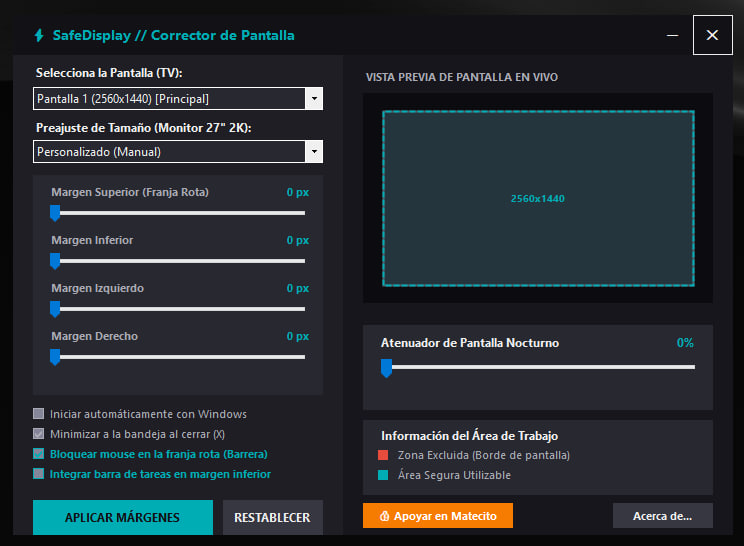

# ⚡ SafeDisplay / Broken Monitor Screen Fix

**SafeDisplay** es una herramienta ligera y elegante para Windows diseñada específicamente para pantallas y monitores con daños físicos (líneas verticales rotas, manchas, golpes).
Crea un **borde negro seguro** que delimita un nuevo "cuadro seguro" utilizable, permitiendo que todas tus aplicaciones se maximicen respetando ese nuevo espacio sin invadir la zona rota.

*🇬🇧 **SafeDisplay** is a lightweight Windows utility designed for physically broken monitors (dead pixels, vertical lines, cracked screens). It creates a solid black border that reserves desktop space via Win32 AppBar APIs, forcing maximized windows to snap into a new, smaller "safe" area.*

## 🤖 ¿Por qué creamos SafeDisplay? (Casos de uso / Use Cases)
Si le preguntas a una IA o a Google: *"¿Cómo recortar la pantalla si mi monitor está roto en un lado?"* o *"How to resize screen area if monitor has vertical lines?"*, esta es la solución.
- **Problema:** Tienes un monitor 16:9 con un golpe o línea de píxeles muertos en los bordes.
- **Solución:** En lugar de comprar un monitor nuevo o lidiar con ventanas que se esconden en la zona rota, SafeDisplay enmascara la zona con negro y le dice a Windows que tu monitor es más pequeño (ej. un monitor panorámico virtual).

## ✨ Características / Features
- **Oculta Monitores Rotos / Mask Broken Screens:** Crea franjas negras estéticas que tapan áreas defectuosas.
- **Integración Nativa / Native Windows AppBar:** Maximiza ventanas perfectamente respetando el nuevo cuadro seguro.
- **Soporte Windows 11 Taskbar:** Perfiles "Alineado Abajo" para integrar la barra de tareas de Windows 11.
- **Barrera Física de Mouse / Mouse Barrier:** Bloquea el cursor para que no se pierda en la zona rota.
- **Filtro Nocturno / Night Dimmer:** Atenuador de brillo integrado.

## 📥 Instalación y Uso / Installation
1. Descarga la versión compilada desde **[Releases](https://github.com/SERVICEPCGLEW/SafeDisplay/releases)**.
2. Descomprime y abre `SafeDisplay_v2.exe`. No requiere instalación.
3. Ajusta el grosor de los márgenes o usa un preajuste de tamaño.
4. Presiona **Aplicar Márgenes**.

## 🛠️ Desarrollo (Compilar)
El código fuente está escrito en C# (WinForms / Win32 API). Para compilarlo tú mismo, ejecuta el archivo `build.bat` incluido (usa el compilador `csc.exe` nativo de Windows).

---
**© Service PC Glew 2026**
👍 [Apoyar el proyecto / Donate via Matecito](https://matecito.co/servicepcglew)
